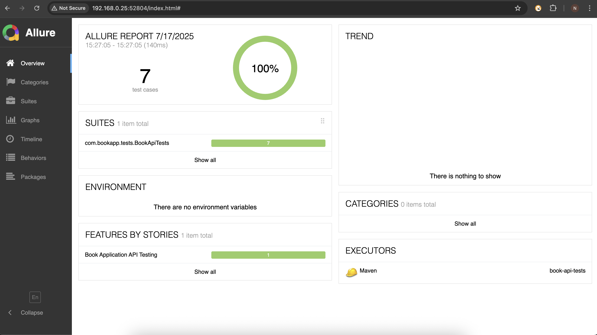
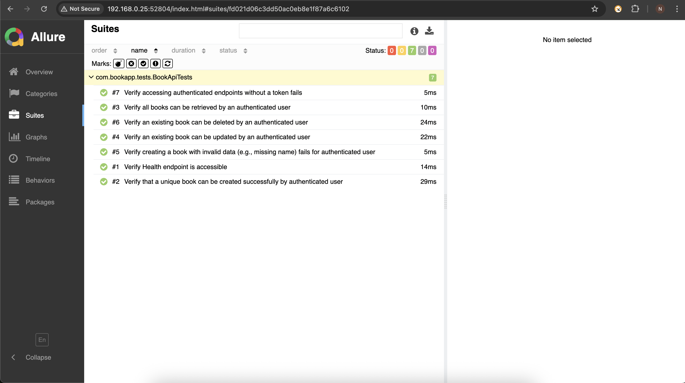

# 📚 Book Application API Automation Tests

This repository contains a robust and scalable automated API testing framework for the **Simple Book Application**. It is built using **Java**, **Maven**, **RestAssured**, and **JUnit 5**, and follows a modular, layered architecture to promote reusability, maintainability, and scalability.

---

## 🚀 Overview

The framework is designed to validate the functionality, reliability, and correctness of the Book Application’s RESTful APIs. It includes test coverage for:

- **User Management:** Signup, login, and authentication.
- **Book Operations:** Create, retrieve, update, and delete book records.

---

## ✨ Key Features

- **Full API Coverage:** Functional test coverage for user and book endpoints.
- **Token-Based Authentication:** Automates user signup and login to handle Bearer token usage.
- **Layered Design:** Separates responsibilities into POJOs, Service Helpers, Factories, and Test Classes.
- **Dynamic Test Data:** Uses `javafaker` to generate unique, realistic test inputs.
- **Expressive Assertions:** Leverages AssertJ for fluent, readable validations.
- **Async Handling Ready:** Uses Awaitility for future async operations and robust polling (if required).
- **Allure Reporting:** Generates rich, interactive test reports for visual analysis.
- **CI/CD Ready:** Integrated with GitHub Actions for automated execution on push and PR events.
- **Externalized Config:** Sensitive data and URLs are managed via a `config.properties` file.

---

## 🧱 Architecture

The framework follows a clean layered architecture:

- **POJOs:** Data models (`Book`, `User`, `AuthResponse`, etc.) using Lombok and Jackson.
- **Request Helper:** Builds common request specifications, handles auth headers and base URI.
- **Service Layer (API Helpers):** Contains direct API call logic (e.g., `BookApiServiceHelper`).
- **Factory Layer:** High-level business flows that orchestrate multiple API calls (e.g., `BookApiFactory`).
- **Test Layer:** JUnit 5 test classes that define and execute test cases.
- **Test Base:** Centralized base class (`TestBaseSimplified`) for common configuration and setup.

---

## 📋 Prerequisites

Ensure the following tools are installed before running the tests:

- **Java JDK 17+** – [Adoptium Temurin recommended](https://adoptium.net/)
- **Maven 3.6+**
- **Allure CLI** – [Installation Guide](https://allurereport.org/docs/gettingstarted-installation/)
- **Running Book Application API** – Default assumed URL: `http://localhost:8000`

---

## ⚙️ Setup Instructions

### 1. Clone the Repository

```bash
  git clone https://github.com/Gaddale/bookstore-api-tests
  cd bookstore-api-tests
```
### 2. Configure config.properties
Update the base URL if your API runs on a different host:
```bash
  # src/test/resources/config.properties
base.url=http://localhost:8000
```
### 3. Import into IntelliJ IDEA

- Open the project using `pom.xml`.
- Enable Annotation Processing:
  `Settings > Build, Execution, Deployment > Compiler > Annotation Processors > Enable`
- Install Lombok Plugin from IntelliJ Plugin Marketplace.
- Verify SDK: Ensure project SDK is set to JDK 17.
- Invalidate Caches (if needed):
  `File > Invalidate Caches / Restart > Invalidate and Restart`

## ▶️ Running Tests
Run All Tests
```bash
  mvn clean install
  mvn test
```
Allure results will be generated at: `target/allure-results`

## 🏷️ Running by Tags (Groups)
```bash
  mvn test -Dgroups=smoke     # Smoke tests only
  mvn test -Dgroups=sanity    # Sanity tests only
```

## 🔁 CI/CD – GitHub Actions
Automated tests are run using GitHub Actions on:
- Pushes to `main` or `develop`
- Pull Request events

Workflow File: `.github/workflows/api-tests.yml`

CI Artifacts:
Allure results (`allure-results-raw.zip`) are uploaded as artifacts.

**Viewing CI Results:**
1. Go to your repo → Actions tab.
2. Select a workflow run → Download `allure-results-raw.zip`.
3. Unzip and run locally:
   ```bash
   allure serve <unzipped-folder>
    ```
## 📁 Project Structure

```bash 
bookstore-api-tests/
├── src/test/java/
│   ├── base/               # Test base config
│   ├── factories/          # Business logic orchestration
│   ├── helpers/            # API request helpers
│   ├── models/             # POJOs (Book, User, Auth)
│   ├── tests/              # JUnit test classes
├── config.properties       # Base URL and configuration
├── pom.xml                 # Maven dependencies
└── .github/workflows/      # GitHub Actions CI pipeline
```

## 🧪 Sample Allure Report



